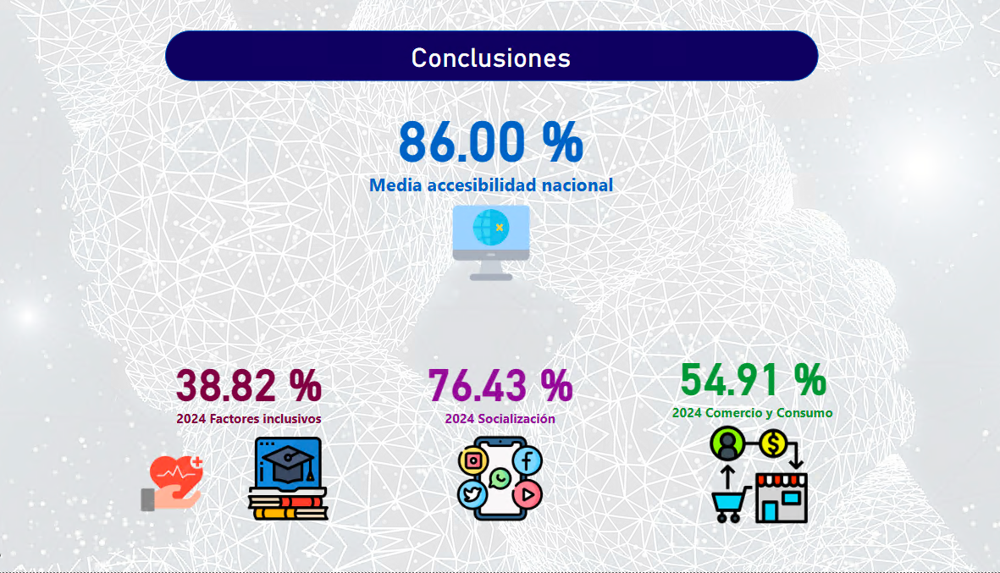

# 📘 Estudio sobre la Brecha Digital en España

Este proyecto está enfocado en analizar la **brecha digital** en España, identificando las desigualdades en el acceso, uso y consecuencias de las **Tecnologías de la Información y la Comunicación (TIC)** en distintos sectores de la población española. 

## 🚀 Objetivos

- **Obtener** las dimensiones de la brecha digital en España.

- **Identificar** los patrones de la brecha digital presentes en España, considerando variables como el acceso a internet, la disponibilidad de dispositivos y el uso de TICs en los hogares. 

- **Profundizar** en las inferencias e impacto que creemos existe entre este fenómeno y el nivel de formación/ocupación de la población y la tasa de desempleo por regiones del país. 

- **Generar visualizaciones interactivas** para facilitar la comprensión y presentación de los resultados.
---
## 📂 Estructura del Proyecto

### 📂 datos

- **csv**: Contiene los archivos CSV en crudo con los datos extraídos para este estudio.

### 📂 transformaciones

  - `dataset_ue.ipynb`: Jupyter_notebook donde se realiza la limpieza de los datos extraídos referentes a la UE.

  - `dataset_global.ipynb`: Jupyter_notebook donde se realiza el estudio y limpieza de varios de los csv estraídos del INE (Instituto Nacional de Estadística) como valor central de la situación en España .

### 📂 visualizaciones

  - `brecha_digital.pbix`: Archivo de Power BI con las visualizaciones y gráficos interactivos para la exploración de los resultados. 

---

### 🎯 Conclusiones: Brecha Digital. Más Allá del Acceso
---

### 🧭  1. Nuevo Enfoque

**Antes: ¿Tienes acceso a Internet?**
**Ahora: ¿Usas la tecnología de forma efectiva y productiva?**

**La brecha digital ya no se mide solo por conexión, sino por el uso significativo de la tecnología.**

### 📉 2. Desigualdades en Competencias

**Grupos más afectados:**

- 👵 Adultos mayores
- 🧑‍🏫 Personas con bajo nivel educativo
- 🌄 Habitantes de zonas rurales

**La mayoría tiene acceso, pero no todos saben aprovecharlo.**

### 🚀 3. Productividad Digital: ¿El uso digital mejora tu vida?

- Empleo
- Educación
- Salud
- Participación ciudadana

**Se necesita medir si el uso tecnológico genera beneficios reales.**

España:

Unión Europea:

### 💡 4. Impacto en la Calidad de Vida: Más que conectarse, se trata de:

- Acceder a servicios útiles
- Encontrar oportunidades
- Construir redes de apoyo
- El verdadero valor está en cómo la tecnología transforma vidas.

### 🏛️ 5. Políticas Públicas Inteligentes

**Más que conexión: formación digital adaptada**

---

## 🪜 Próximos pasos

A partir de las conclusiones obtenidas, se plantea la necesidad de continuar el análisis con una perspectiva más focalizada y contextual. En particular, se identifican líneas clave de acción para avanzar en la comprensión y reducción de la brecha digital:

---

## 1. Profundizar en la relación entre uso de Internet y desempleo

Es fundamental **comprender mejor cómo el nivel de uso digital incide en la empleabilidad** y viceversa. Para ello:

- Explorar correlaciones entre **niveles de uso de Internet, competencias digitales y tasas de desempleo** por territorios.
- Identificar si existen **barreras específicas que impiden a personas desempleadas aprovechar las herramientas digitales** para la búsqueda de empleo o el autoempleo.

---
## 2. Estudio específico de Ceuta y Melilla

Ceuta y Melilla presentan **características estructurales particulares**, tanto por su evolución histórica como por sus **elevadas tasas de desempleo**, que justifican una investigación diferenciada. Se propone:

- Analizar cómo estas tasas de desempleo **afectan el uso y la productividad del acceso a Internet**.
- Estudiar el papel que juega la brecha digital en el **acceso al empleo, la educación y los servicios públicos digitales** en ambas ciudades.
- Comparar estos resultados con otras regiones con desafíos similares para establecer patrones o singularidades.

---

## 📚 Fuetes Principales

- **INE (Instituto Nacional de Estadística): https://www.ine.es**:
  
  Evolución de datos de Viviendas (2006-2024) por Comunidades y Ciudades Autónomas, tipo de equipamiento y periodo  [Fuente](https://www.ine.es/jaxi/Tabla.htm?tpx=70470&L=0)

  Nivel y condiciones de vida: [Fuente](https://www.ine.es/jaxi/Datos.htm?tpx=70388#_tabs-grafico)

  Datos de Viviendas por Comunidades y Ciudades Autónomas, tamaño del hogar, tipo de hogar, hábitat, ingresos mensuales netos del hogar y tipo de equipamiento: [Fuente](https://www.ine.es/jaxi/Datos.htm?tpx=70466)

- **UNESCO (2021)** : Reimagining our futures together: A new social contract for education. [Fuente](https://unesdoc.unesco.org/ark:/48223/pf0000379381_spa)

- **OCDE (2020)**: The Digital Transformation of Education: Connecting Schools and Communities. [Fuente](https://www.oecd-events.org/smart-data-and-digital-technology-in-education/session/05a01636-3dfd-ec11-b47a-a04a5e7cf9da/the-digital-transformation-of-education-connecting-schools-empowering-learners)

- **Digital economy and society statistics - households and individuals**
  - [Fuente](https://ec.europa.eu/eurostat/statistics-explained/index.php?title=Digital_economy_and_society_statistics_-_households_and_individuals)

  - [Fuente](https://ec.europa.eu/eurostat/databrowser/view/isoc_ci_ac_i__custom_16380599/default/table?lang=en)

- **Otras fuentes:** Obtención del mapa de formas de España. [Mapa](https://github.com/FMullor/TopoJson/blob/master/Espa%C3%B1aAgrupada.json)

---
